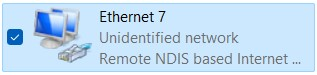
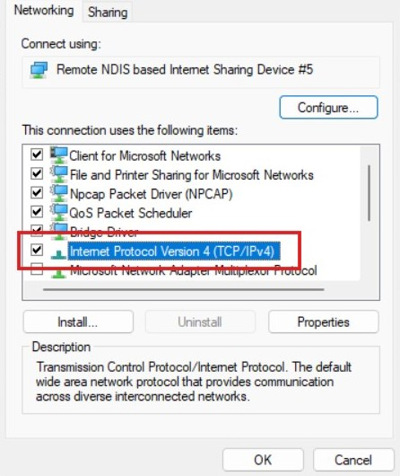
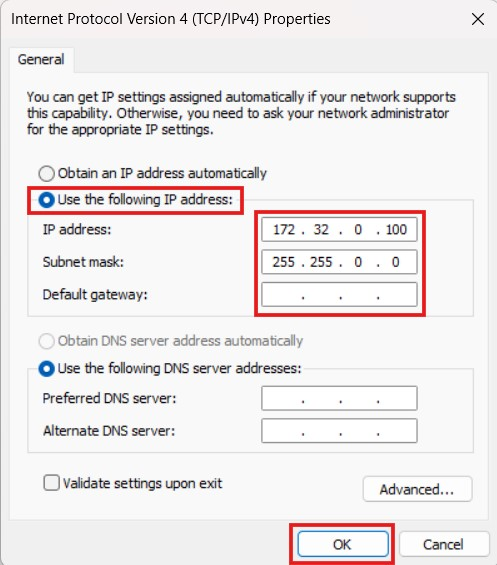
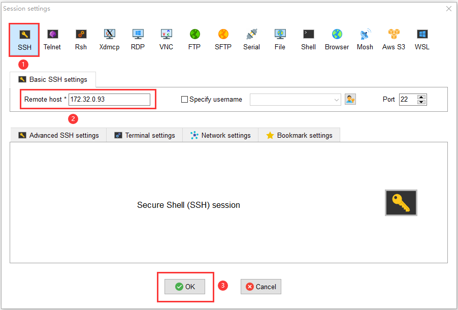
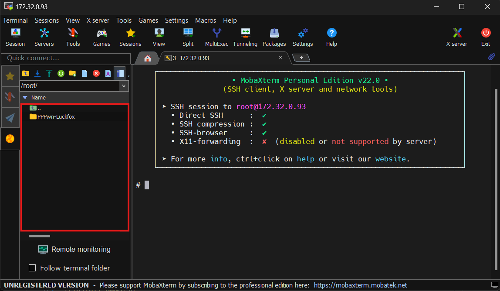

# PPPwn-Luckfox

An alternative low-cost Linux board for exploits PS4 on V11.00 or below.<br>
Original work by theflow <a href=https://github.com/TheOfficialFloW/PPPwn>PPPwn</a> 
and thanks to xfangfang <a href=https://github.com/xfangfang/PPPwn_cpp>PPPwn-CPP</a> for an executable re-write of PPPwn in C++ and SiSTRo for his <a href=https://github.com/GoldHEN/GoldHEN>GoldHen</a>, and lastly <a href=https://github.com/stooged/PI-Pwn>Stooged</a> for his inspiration. <br>

## Note

- Currently support version: `9.00, 9.60, 10.00, 10.01, 11.00`
- The average PPPwned time is around `1min - 2min` sometimes it loads under `1 minute`
- Using `pppwn` nightly build from xfangfang PPPwn_cpp <be>
  
## Web Server Features

Thanks to [@harsha-0110](https://github.com/harsha-0110) for the webserver base scripts and PHP.<br>

You can access it at `192.168.1.1` on your PS4 browser. It allows you to:

- Change your PPPwn settings
- Shutdown your Luckfox device
- Execute PPPwn
- Inject payloads (make sure to enable BinLoader in GoldHEN)
- Turned on/off auto-run on boot (on by default)
  
You can manually edit the configuration file located at `/etc/pppwn/config.json`.

## Support Boards

- <b>Luckfox Pico</b><br>
- <b>Luckfox Pico Pro</b><br>
- <b>Luckfox Pico Max</b><br>
- <b>Luckfox Pico Plus</b><be>
- <b>Luckfox Pico Mini A/B</b><br>

## Requirements

- One of Luckfox Pico models above
- SD Card 4GB or above (for Luckfox Pico/Mini A)
- Ethernet Cable
- USB Type-C
- A USB drive with exFAT32 formatted (only use for the first time to load GoldHEN)
- PC/Laptop for config the Luckfox


## Installation

Before proceeding make sure to disable your anti-virus software, it is a false positive and completely safe. If you are still concerned please don't proceed any further!

Download one of the custom buildroot image for your respective Luckfox models below or from the [release](https://github.com/0x1iii1ii/PPPwn-Luckfox/releases) pages.

- NAND Flash boot

   Luckfox Model  | Buildroot Image
   ------------- | -------------
   Luckfox Pico Pro/Max  | [download](https://github.com/0x1iii1ii/PPPwn-Luckfox/releases/download/1.2.2/buildroot_pro_max_image_pppwn_NAND.zip)
   Luckfox Pico Plus/Mini B | [download](https://github.com/0x1iii1ii/PPPwn-Luckfox/releases/download/1.2.2/buildroot_plus_image_pppwn_NAND.zip)


- SD Card boot

   Luckfox Model  | Buildroot Image
   ------------- | -------------
   Luckfox Pico/Mini A | [download](https://github.com/0x1iii1ii/PPPwn-Luckfox/releases/download/1.2.2/buildroot_plus_image_pppwn_SD.zip)


1. Use [SocToolKit](https://drive.google.com/file/d/1ALo4G7rEaF1GNhUHINoYHT_RGWGddzYw) to burn the buildroot image you downloaded above to your Luckfox. 
   - If you're using luckfox with `NAND Flash`, proceed to burn the OS by following the official Luckfox tutorial <a href=https://wiki.luckfox.com/Luckfox-Pico/Luckfox-Pico-RV1103/Luckfox-Pico-Flash-burn-image>here</a>.
   - If you're using luckfox with `SD Card`, proceed to burn the OS by following the official Luckfox tutorial <a href=https://wiki.luckfox.com/Luckfox-Pico/Luckfox-Pico-RV1103/Luckfox-Pico-SD-Card-burn-image>here</a>.
2. Plug your luckfox to your PC via USB type-c port and wait a few minutes until you hear the device connect sound.
3. On your PC open `Control Panel -> Network and Internet -> Network and Sharing Center -> Change Adapter Options`. You will find `Remote NDIS based Internet Sharing Device`. Right-click and choose Properties.<be>

      

4. Double-click on `Internet Protocol Version 4 (TCP/IPv4)`. Set the IPv4 address to `172.32.0.100` and subnet mask to `255.255.0.0` and click OK.<be>

      <p float="left">
        
         
      </p>

5. MobaXterm Login
   - Download <a href=https://drive.google.com/file/d/1pLikKXgdJNWqmylq8UYwXPDGaEDfxjNG>MobaXterm</a> and unzip to use.
   - Open the MobaXterm remote login software, choose Session->SSH, and enter the static IP address of Luckfox pico as `172.32.0.93`.<br>
   
        
  
   - After filling it out, click OK, enter the login name, and login `root` password `luckfox`.
6. At this point, you have successfully logged in to Luckfox pico. Download <a href=https://github.com/0x1iii1ii/PPPwn-Luckfox/releases/download/1.2.2/PPPwn-Luckfox-v1.2.2.zip>PPPwn-Luckfox</a> from release pages or from GitHub repo, unzip and rename folder to `PPPwn-Luckfox` drag and drop the files in the highlight red rectangle there, it will copy the files to the luckfox. <be>
   
   
   
7.  After finish copy, paste this cmd, and follow the instructions.

```sh
cd PPPwn-Luckfox
chmod +x install.sh
./install.sh
```
Once the Luckfox reboots pppwn will run automatically.<be>

## Installation Hardware

1. You simply need to connect the LAN cable from Luckfox Pico to the PS4 and power the Luckfox from the PS4 via a USB Type-C cable or other sources.

## On PS4:<br>

- Go to `Settings` and then `Network`<br>
- Select `Set Up Internet connection` and choose `Use a LAN Cable`<br>
- Choose `Custom` setup and choose `PPPoE` for `IP Address Settings`<br>
- Enter `ppp` for both `PPPoE User ID` and `PPPoE Password`<br>
- Choose `Automatic` for `DNS Settings` and `MTU Settings`<br>
- Choose `Do Not Use` for `Proxy Server`<br>

For Goldhen you need to place the goldhen.bin file onto the root of a USB drive and plug it into the console.<br>
Once Goldhen has been loaded for the first time it will be copied to the console's internal HDD and the USB is no longer required.<br>
To update Goldhen just repeat the above process and the new version will be copied to the internal HDD. <be>
